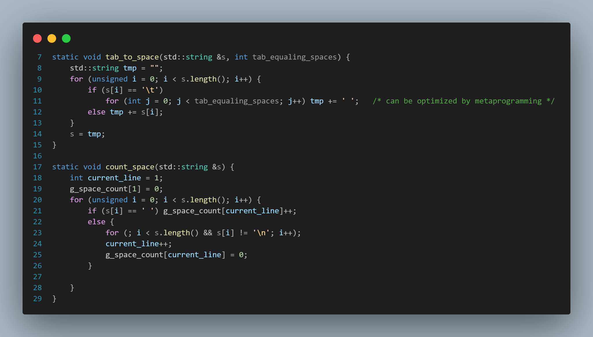
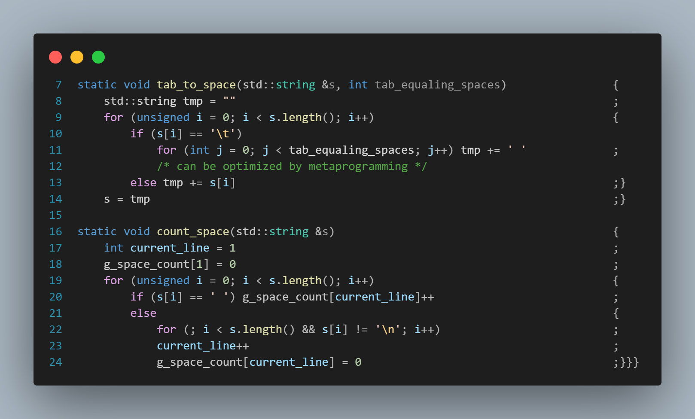

# STRADE : 让您的代码轻松搁浅\!

---

## INTRODUCTION

对类C语言源文件使用, 生成一个缩进结构类似Python的新排版.

## BUILD

> make

或MinGW64:

> mingw32-make

可执行文件在debug目录下
.

## USAGE

> strade [SOURCE] (-o [TARGET]) (-w [MAX_WIDTH])

`[SOURCE]` 指定要变换的源.

`-o [TARGET]` 可选, 指定目标. 默认为源文件加上`-strade`后缀.

`-w [MAX_WIDTH]` 可选, 指定分号及花括号被对齐到第几个字符. 默认为`120`.

## SAMPLE

`preprocess.cpp` 如下图:

执行命令:
> strade preprocess.cpp -o sample -w 80

得到 `sample` 如下图:

## TODO  

debug.

`-f` 选项: 转换目标文件夹下的每一个文本文件.

`-l` 选项: 指定目标语言(以支持不同注释样式).